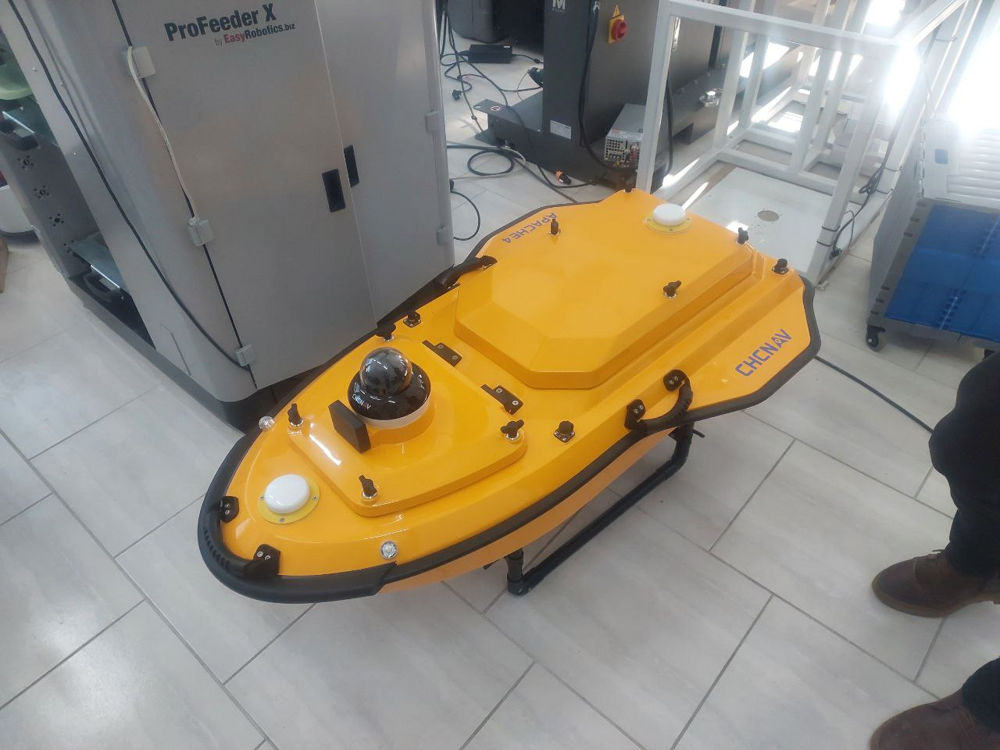
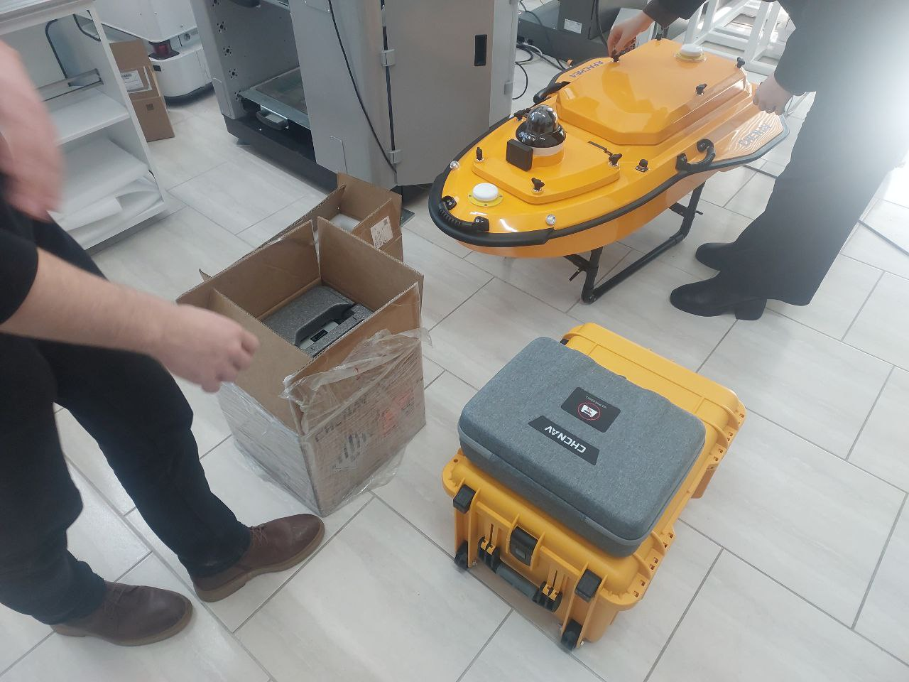
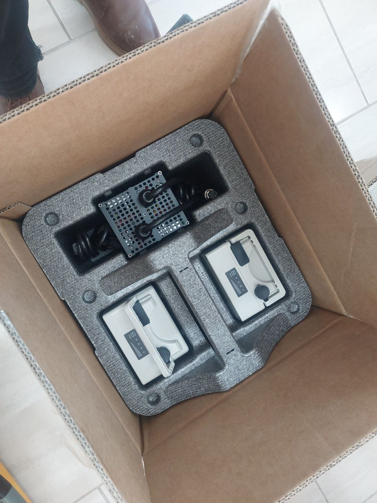
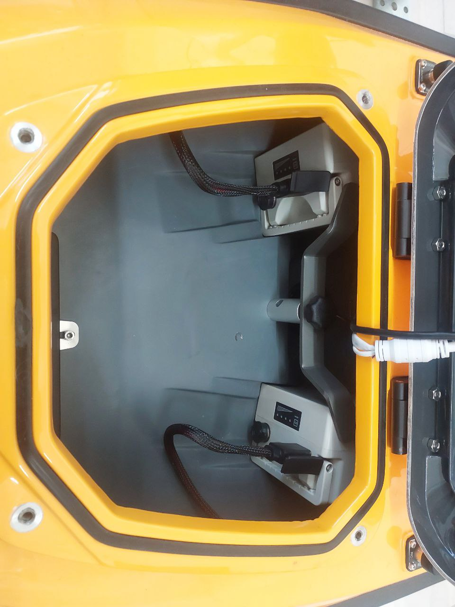
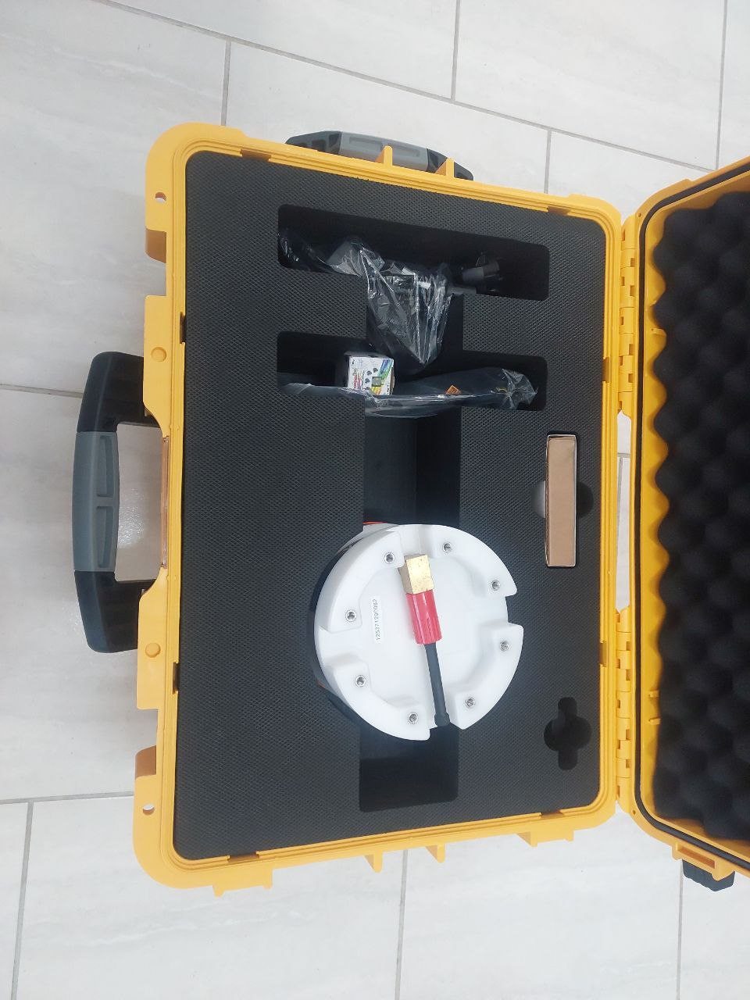
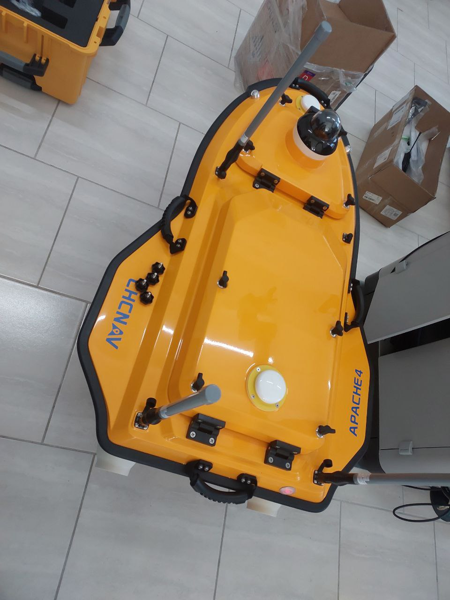
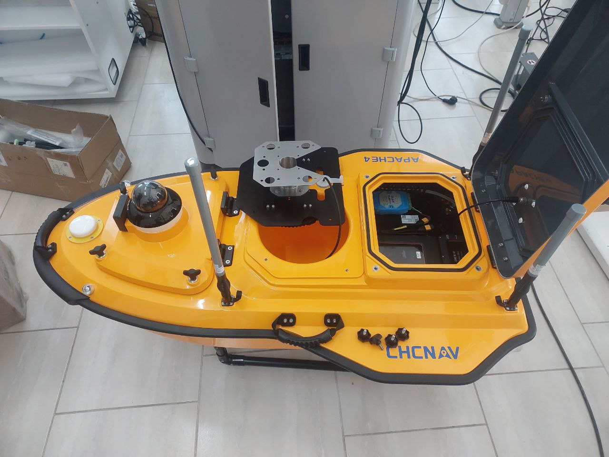
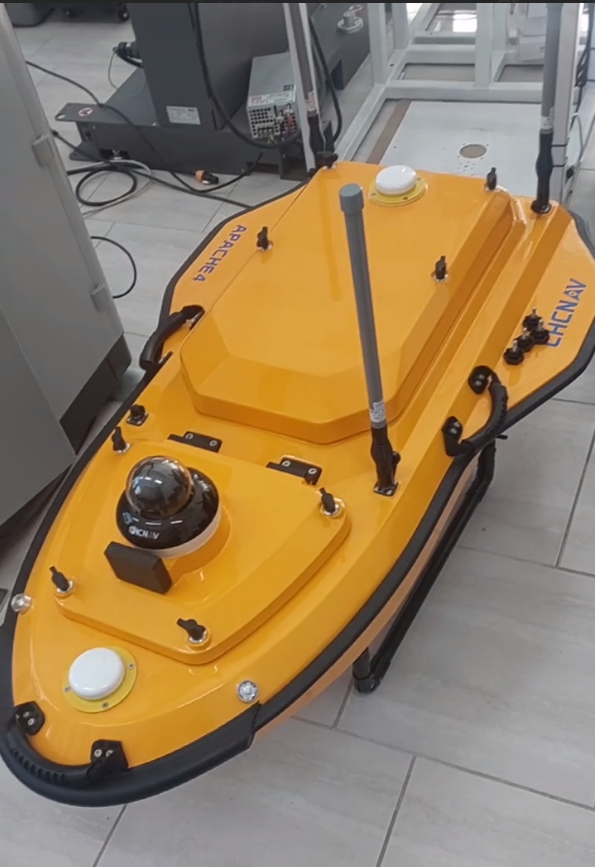

# Отчет по сборке беспилотного катера на базе Apoche4 CHCNAV

## 1. Введение
Целью данной работы являлась физическая сборка и интеграция аппаратной части беспилотного катера  Apoche4 CHCNAV для проведения гидрографических и исследовательских работ. 

## 2. Комплектация и оборудование
Для сборки использовались следующие ключевые компоненты:
*   **Корпус:**  Apoche4;
*   **Навигационное оборудование:** GNSS-приемник и другое 
*   **Движители:** Два водомета.
*   **Аккумуляторы:** Литий-ионные акумуляторы 2шт.
*   **Полезная нагрузка:** эхолот, ADCP.
*   **Пульт управления:** на базе Android.

## 3. Этапы физической сборки
Сборкапроходила следующим образом:
*   Установка батарей в носовой отдел
*   Распаковка и установка 4 антен (одна радио и 3 WiFi)
*   Установка ADCP прибора.Операция прошла безуспешно, полскольку отсек для подключения аппарата был намертво приклеен к корпусу неизвестными инжинерами.
*   Подсоединение проводов 

## 4. Итог
По концу работу был проведен запуск (по кнопке на корпусе). Индикатор работы катера замигал красным индифицируя об успешном подклчении к питанию батарей. Подключение к пульту не произошло, посколько для работы будет неоюходимо сконфигурировать локальную сеть Wifi, что будет проделано в следующей лабораторной работе.

Приложение:
## До сборки

## Распаковка:

## Батареи и батарйный отсек:

## ADCP:

## Установка антен

## Внутренние отсеки (отсек ADCP по центру и отсек управления справа)

## Итог сборки
