# Итоговый отчет по лабораторной работе №6

## Тема
Комплексный вывод по всей проделанной работе в проекте беспилотного гидрографического катера CHCNAV APACHE 4.

## 1. Цель работы
Подвести итог по всем выполненным этапам: изучение документации, сборка аппаратной части, настройка сетевого взаимодействия, конфигурация программной среды и подготовка катера к практическим испытаниям на воде.

## 2. Краткое содержание выполненных этапов

### Этап 1. Анализ документации и архитектуры комплекса
- Изучены назначение и состав комплекса CHCNAV APACHE 4.
- Рассмотрены основные характеристики платформы, включая навигацию GNSS+IMU, однолучевой эхолот и возможность интеграции ADCP.
- Изучено программное обеспечение для планирования миссий и обработки данных.

### Этап 2. Физическая сборка катера
- Выполнена распаковка и базовая компоновка оборудования.
- Установлены аккумуляторы и антенны.
- Проведено первичное включение и проверка индикации питания.
- Зафиксированы ограничения по установке части полезной нагрузки (узел ADCP потребовал дополнительной подготовки).

### Этап 3. Настройка сети и каналов связи
- Изучена схема связи "берег - катер" для локального и мобильного каналов.
- Выполнена первичная настройка параметров подключения и проверка телеметрии.
- Подготовлен алгоритм проверки устойчивости связи и базовых процедур безопасности.

### Этап 4. Полная конфигурация и предстартовая подготовка
- Выполнены проверки силовой установки и управления.
- Подготовлены картографические материалы района работ.
- Проведен цикл предпусковых проверок: корпус, связь, навигация, готовность датчиков.
- Система приведена в состояние готовности к выходу на воду и выполнению гидрографической миссии.

## 3. Основные результаты
- Получено целостное понимание технологии эксплуатации беспилотного гидрографического катера.
- Сформирован рабочий аппаратно-программный контур управления.
- Подтверждена готовность платформы к полевым испытаниям и сбору гидрографических данных.
- Определены направления дальнейшей работы: калибровка, практические миссии, обработка и анализ измерений.
- Тестовый запуск катера
  
## 4. Итоговый вывод
В рамках всех выполненных лабораторных этапов поставленные задачи достигнуты. Проведены подготовительные, технические и конфигурационные работы, необходимые для практической эксплуатации катера CHCNAV APACHE 4. Комплекс находится в рабочем состоянии и готов к переходу к следующему этапу: реальным обследованиям акватории, накоплению измерений и формированию карт глубин/потоков.

## 5. Приложение: фотофиксация этапов работ

### 5.1. Фото из предыдущих лабораторных
#### До сборки
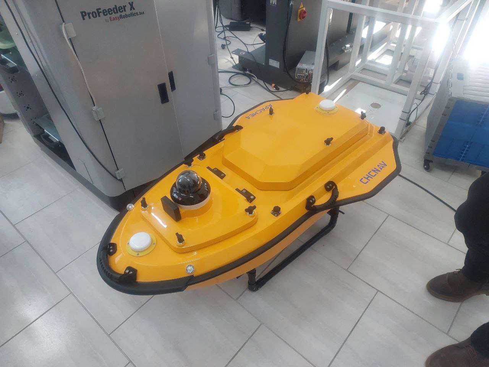

#### Распаковка
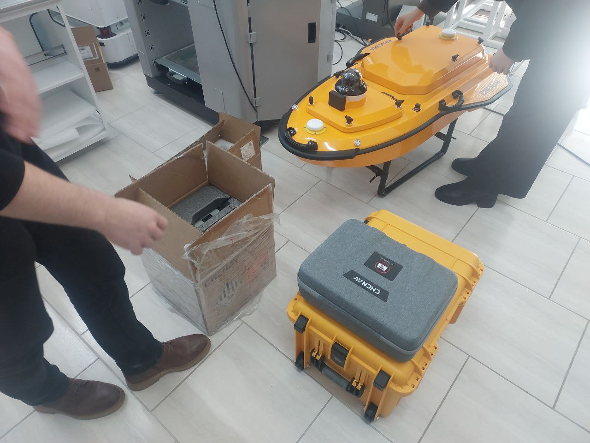

#### Батареи и батарейный отсек
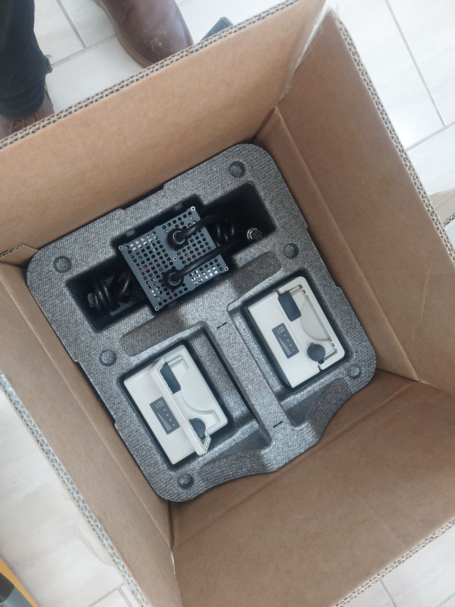
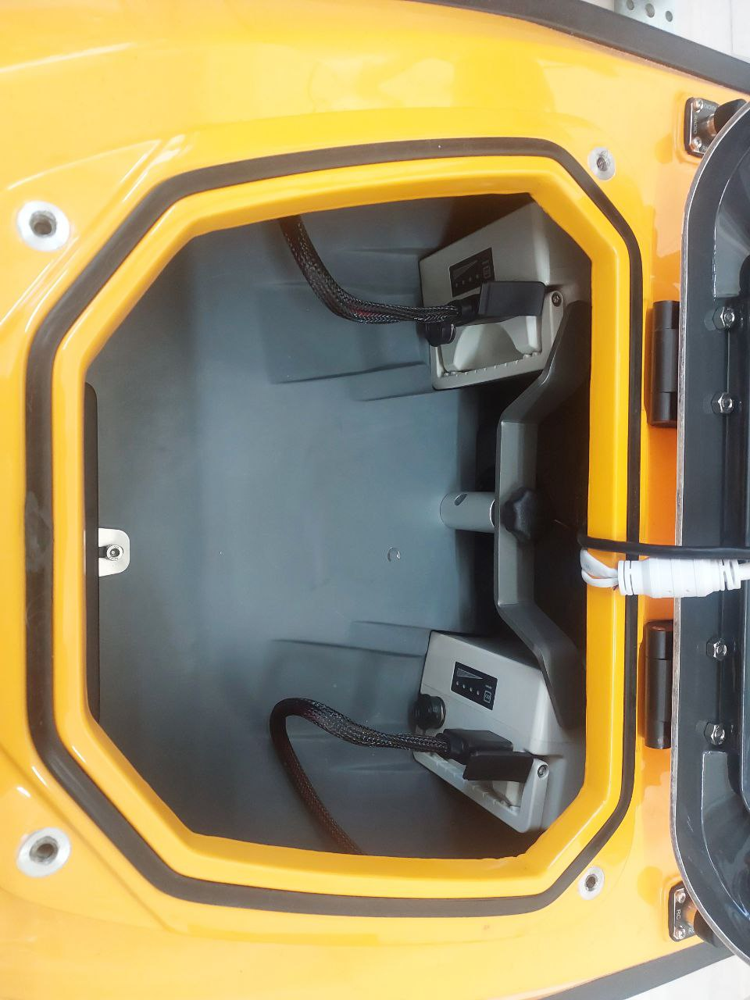

#### Установка и размещение оборудования
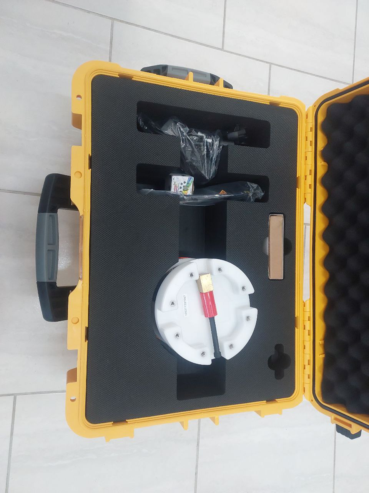
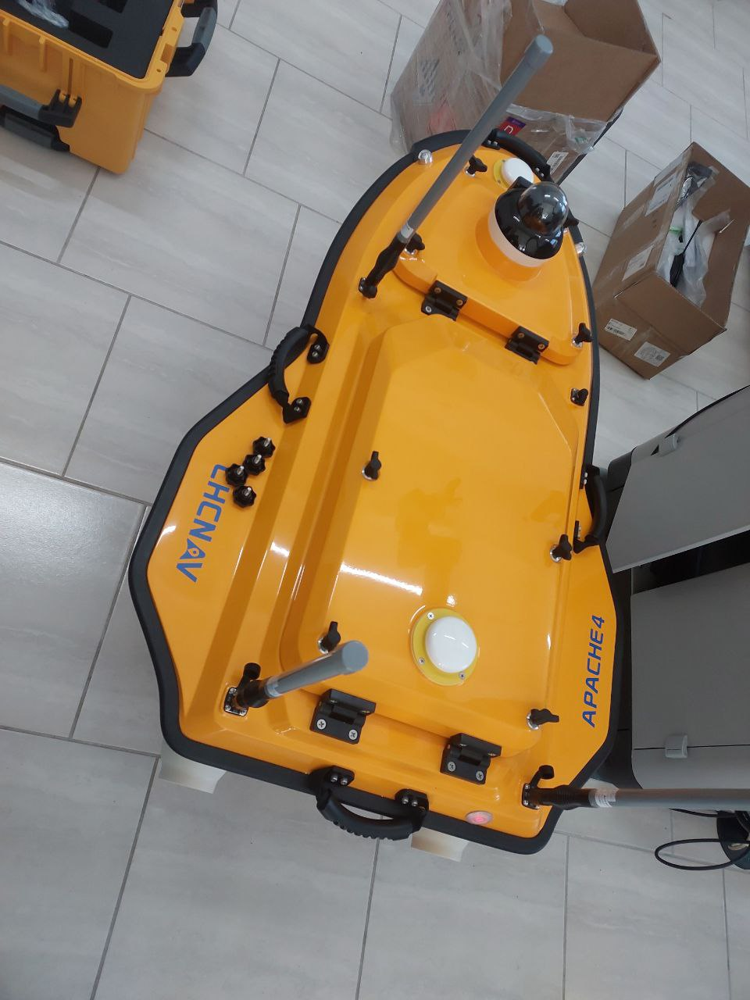
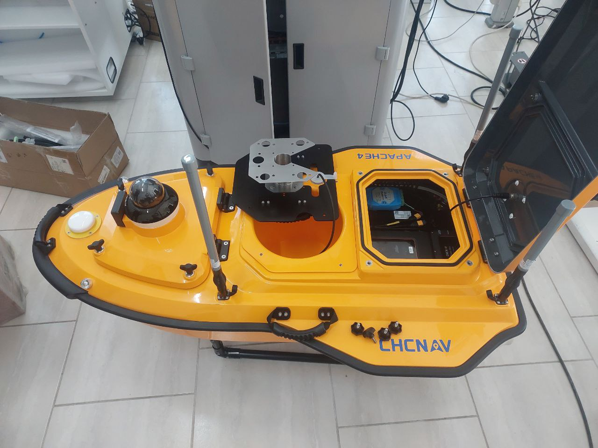

#### Итог физической сборки
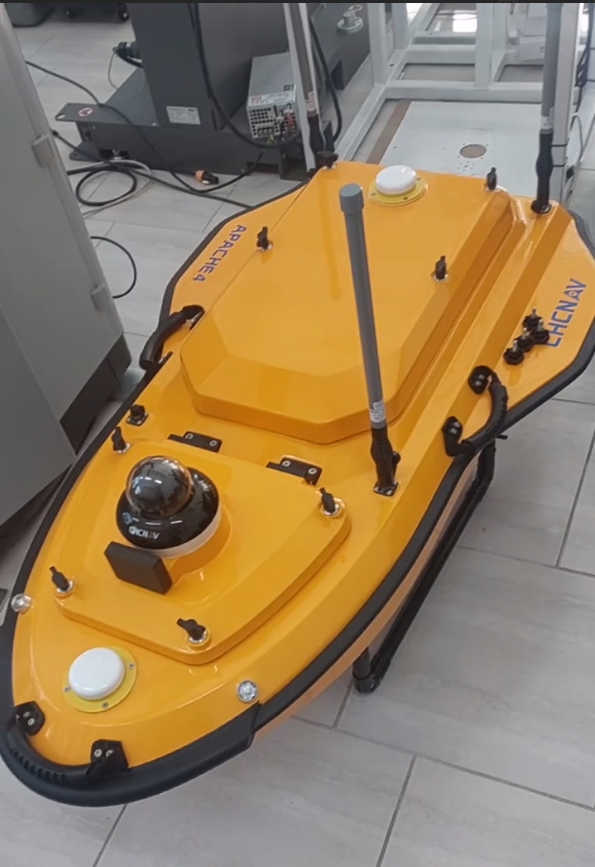

#### Включение и настройка связи
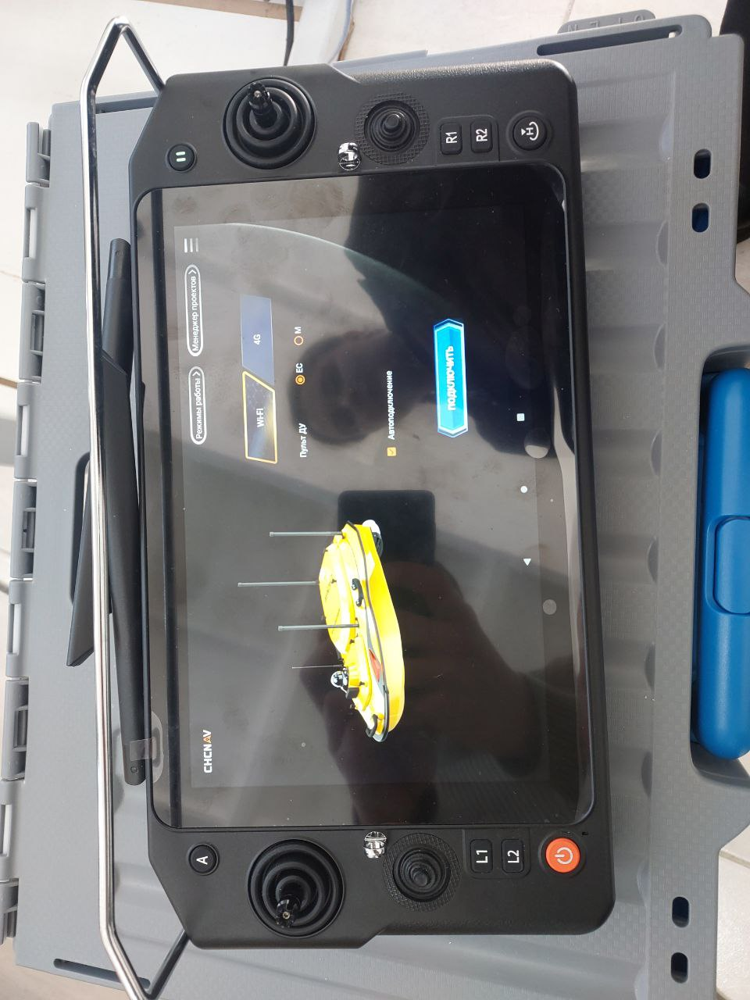
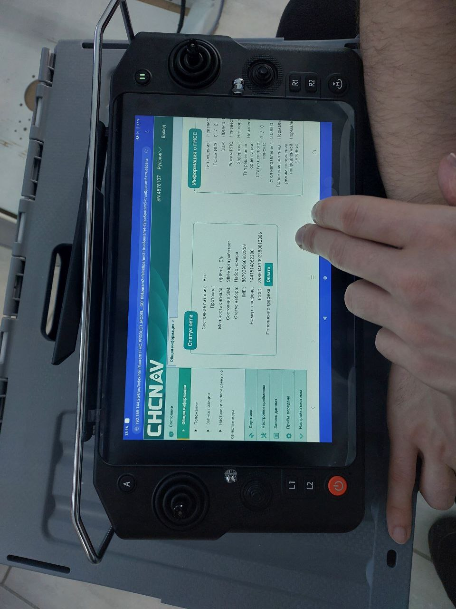
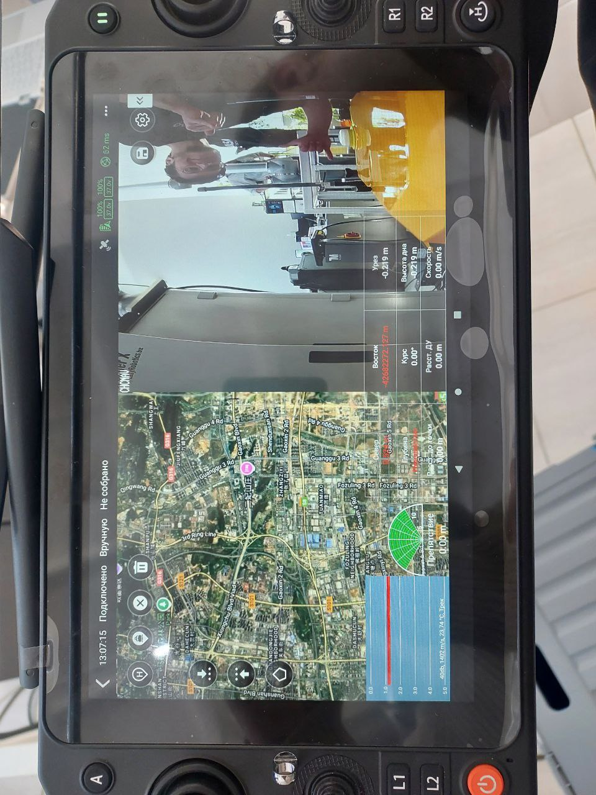

### 5.2. Новые изображения запуска катера
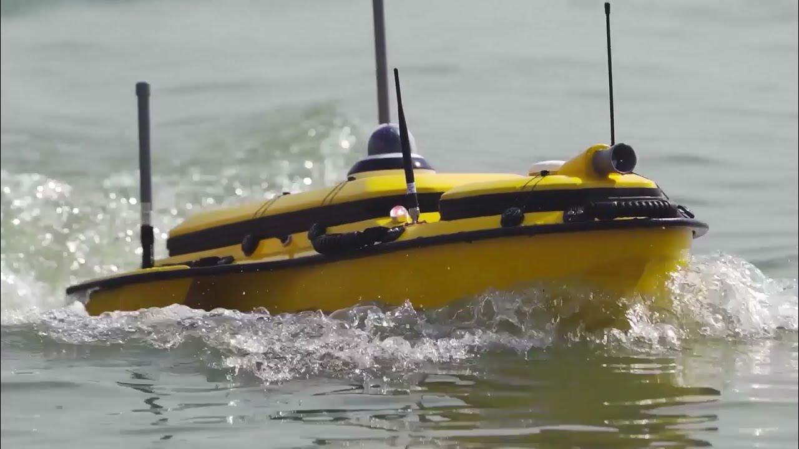
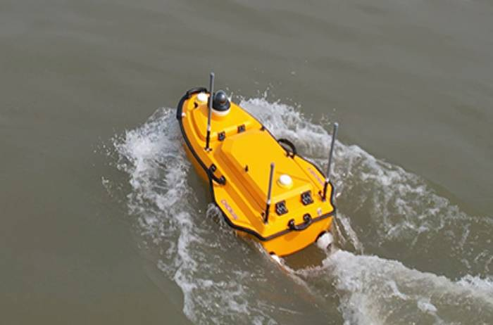
